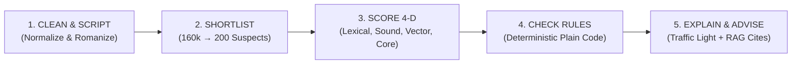

# PRGI TitleGuard • Front-End Architecture & Automated Verification Suite
> **Smart India Hackathon • Problem Statement PSS06: Automated Press Title Verification & Agentic System**  
> **Branch:** `frontend` (Member 6 • Layer 3 Lead)

---

## 🏛️ Executive Summary

Under the **Press and Registration of Periodicals Act, 2023**, the **Press Registrar General of India (PRGI)** must verify every proposed periodical and newspaper title against **160,000+ existing registered titles**.

### Key Problem Challenges Solved:
1. **Word Order / Anagram Variations:** Detecting collisions like *Times India* vs registered *India Times*.
2. **Phonetic Spelling Shifts:** Detecting sounding equivalents like *Jaagran Weekly* vs registered *Jagran*.
3. **Cross-Lingual Semantic Concept Collisions:** Matching *Dainik Samachar* vs registered *Daily News* or *Vivah Suchi* vs *Matrimonial List*.
4. **Prefix / Suffix & Core Root Collisions:** Stripping media stop words (*The, Daily, Patrika, Express, News*) so *The Vidarbha Daily Express* immediately collides with registered *Vidarbha Patrika* on the root token *vidarbha*.
5. **Deterministic Statutory Rule Violations:** Rule 4.1a commercial/matrimonial catalog ban, Rule 3.2b internet domain/URL ban, Rule 1.1a single generic word ban, Rule 7.2a character length limits, and Emblems and Names Act.

---

## 🏗️ 3-Layer System Architecture & 6-Member Work Division

```mermaid
graph TD
    subgraph Layer 3 — Application & Agents
        M6["Member 6: Frontend & 3D Dashboard (Next.js / Vite / Three.js)"]
        M1["Member 1: FastAPI Orchestrator (/verify-title)"]
        M5["Member 5: Agentic Workflow (Interviewer → Gen → Verifier → Ranker)"]
    end

    subgraph Layer 2 — AI/ML & Rules
        M2["Member 2: NLP/ML Similarity Engine (4-D Similarity)"]
        M4["Member 4: Deterministic Rules & RAG Explainability (PRGI 2025)"]
    end

    subgraph Layer 1 — Data & Candidate Search
        M3["Member 3: Database & pgvector Search (160k Titles)"]
    end

    M6 <--> M1
    M1 <--> M3
    M1 <--> M2
    M1 <--> M4
    M5 <--> M1
```

| Member | Layer | Role | Core Responsibility | Tech Stack |
| :--- | :--- | :--- | :--- | :--- |
| **Member 1** | Layer 3 | **Backend Integration** | FastAPI API gateway, orchestration pipeline `/verify-title`, Docker | Python, FastAPI, Pydantic |
| **Member 2** | Layer 2 | **NLP / ML Engineer** | Transliteration, 4-D similarity algorithms (Edit, Sound, Vector, Core) | Sentence Transformers, RapidFuzz |
| **Member 3** | Layer 1 | **Database & Search** | Dataset ingestion, PostgreSQL + pgvector, top-K candidate retrieval | PostgreSQL, pgvector, Pandas |
| **Member 4** | Layer 2 | **Rules & RAG** | Deterministic government checks (Emblems Act, Commercial terms, URLs) | Rule Engine, RAG, PRGI 2025 |
| **Member 5** | Layer 3 | **Agentic Title Generator** | 4-Agent pipeline (Interviewer → Generator → Verifier → Ranker) | LangGraph, AI Agents |
| **Member 6** | Layer 3 | **Frontend + 3D UI + QA** | Interactive 3D verification console, transliteration preview, officer copilot, QA | Vite/React, Three.js, Tailwind CSS |

---

## ⚡ 5-Stage Verification Pipeline



1. **Stage 1 (Clean & Script Normalization):** Detects Indic scripts (Devanagari, Bengali, Tamil, Telugu, Gujarati, Urdu, Punjabi) and standardizes Roman phonetic tokens.
2. **Stage 2 (Candidate Shortlisting):** Filters 160,000 titles to top suspects.
3. **Stage 3 (4-Dimensional Similarity Scoring):** Computes Lexical (0–100%), Phonetic (0–100%), Semantic Cross-Lingual (0–100%), and Core Root Token (0–100%) collision scores.
4. **Stage 4 (Deterministic Rule Checks):** Evaluates character limits, commercial term restrictions, internet domain syntax, and Emblems Act.
5. **Stage 5 (Explain & Advise):** Generates Traffic Light verdict (`APPROVED` 🟢, `MANUAL_REVIEW` 🟡, `REJECTED` 🔴) with plain-English legal citations and actionable next steps.

---

## 🎨 Front-End Design & Modules

- **Cinematic Loading Page (`LoadingIntro.tsx`):** Periodical masthead laser scan, frequency jitter/vibration, and smooth optical zoom-in transition into the portal.
- **Warm Beige & Executive Luxury Theme:** Clean ivory-beige palette (`#F8F6F0`), refined typography (`Playfair Display`, `Newsreader`, `Plus Jakarta Sans`), and generous whitespace.
- **Dynamic 3D Ambient Background (`DynamicBeigeBackground.tsx`):** Floating Three.js particle constellation reacting smoothly to ambient dynamics.
- **Interactive Verification Console (`VerificationView.tsx`):** Real-time Indic transliteration visualizer, benchmark test case presets, 4-D similarity progress meters, clashing records table, and PRGI statutory rulebook matrix.
- **AI Agentic Title Studio (`AgenticStudio.tsx`):** 4-Agent collaborative loop generating 100% pre-verified conflict-free alternatives.
- **Officer Review Docket (`OfficerDashboard.tsx`):** Risk-sorted case docket with editable AI Copilot Decision Memorandums.
- **Master Title Registry Explorer (`RegistryExplorer.tsx`):** Client-side explorer indexed over 2,500 real verified titles with multi-filter facets.
- **Procedural Sound Engine (`audio.ts`):** Web Audio API procedural sound feedback (scanner sweeps, target locks, success chimes, and zoom whooshes).
- **Dual-Engine Toggle:** Embedded client-side AI verification engine + one-click toggle to connect to live FastAPI backend (`http://localhost:8000/verify-title`).

---

## 🚀 Quick Start Guide

### Prerequisites
- Node.js 18+
- npm / yarn / pnpm

### Installation & Run

```bash
# Navigate to frontend directory
cd frontend

# Install dependencies
npm install

# Start local Vite development server
npm run dev
```

Open **`http://localhost:5173`** in your browser.

### Build for Production
```bash
cd frontend
npm run build
```
